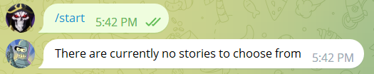
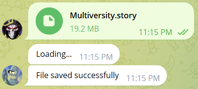
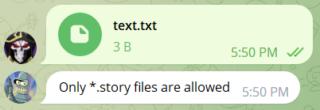
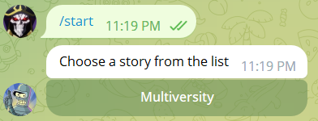
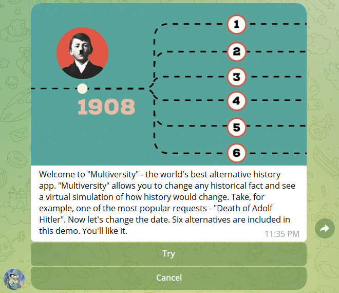

# Storyteller Bot
Storyteller Bot is a telegram bot for telling interactive stories.
## Usage:
The story is a tree-like structure consisting of text, image, and transition options to other stories. Thus, it is possible to create a story with different endings depending on the user's choice.

To start the bot, you must specify the bot token and fill in the list of administrators. The bot token is taken from [@BotFather](https://t.me/BotFather). The list of administrators contains telegram usernames, without the '@' symbol.

```python
token = ''  # Bot token taken from @BotFather https://t.me/BotFather
admins = []  # Usernames that can upload files to the bot
```

The bot automatically detects the user's language and can work in Russian (if the user's language is Russian) and English (in all other cases).

The bot is started with the command "/start".



At first, the bot has no stories. You can upload your own stories by placing them in the "Stories" directory (in the same directory as "main.py") or by sending the story files to the bot if you are on the admin list. For example, let's download a story based on the 17th episode of the 1st season of the series "Love Death + Robots".



The bot only accepts &ast;.story files.



After uploading the story file, the bot will allow you to select the uploaded story from the list to start the storytelling.



During the storytelling process, the bot will show the image, text, and story transition options. The user can select suggested transitions to open the next story until the story ends (no transitions).



Story files (&ast;.story ) are created in the [Storyteller Editor](https://github.com/Andreyman76/Storyteller-Editor).
